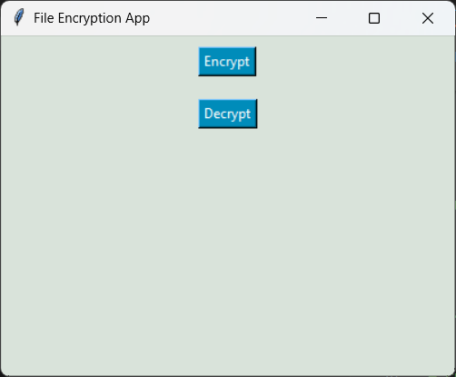

<h1 align="center">File Encryption App</h1>

<p align="center">
  A secure, lightweight, and user-friendly desktop application for encrypting and decrypting your private files using robust encryption.
</p>

## 📋 Table of Contents
- [Overview](#-overview)
- [Key Features](#-key-features)
- [Technical Specifications](#-technical-specifications)
- [Prerequisites](#-prerequisites)
- [Installation](#-installation)
- [Usage](#-usage)

## 📖 Overview
The **File Encryption App** provides a seamless graphical interface to protect your sensitive files. By utilizing symmetric encryption, it ensures that your data remains inaccessible to unauthorized users. A single, user-defined password is all you need to securely lock and unlock files on demand.



## ✨ Key Features
- **Robust Security**: Utilizes Fernet (AES-128 CBC) encryption to guarantee data safety.
- **Stateless Operation**: Prompts for passwords dynamically during encryption/decryption, avoiding the need to store sensitive global state in memory.
- **Reliable Key Generation**: Derives a consistent 32-byte encryption key from your password via SHA-256 hashing.
- **Batch Processing**: Supports encrypting or decrypting multiple files simultaneously for enhanced workflow efficiency.
- **Intuitive GUI**: Clean and straightforward interface built with Python's Tkinter.

## 🛠 Technical Specifications
- **Language**: Python 3.x
- **GUI Framework**: Tkinter
- **Cryptographic Library**: `cryptography.fernet`
- **Hashing Algorithm**: SHA-256 (via `hashlib`)

## ⚙️ Prerequisites
Ensure you have the following installed before running the app:
- Python 3.6 or higher.
- `pip` (Python package installer).

## 🚀 Installation

Install the required Python dependencies:
```bash
pip install cryptography
```

## 💻 Usage

1. **Launch the Application**:
   Run the following command in your terminal or command prompt:
   ```bash
   python "PYTHON PROJECT FINAL.py"
   ```

2. **Encrypt Files**:
   - Click the **Encrypt** button.
   - Enter a strong, secure password in the prompt.
   - Select one or more files to encrypt.
   - Wait for the success confirmation message.

3. **Decrypt Files**:
   - Click the **Decrypt** button.
   - Enter the exact password used for encryption.
   - Select the previously encrypted files.
   - Wait for the success confirmation message.

> **⚠️ Warning:** Do not forget your password. Since the application does not store passwords, it is impossible to recover encrypted files if the password is lost.
